# 第三章 练习解答 —— 记忆系统与 RAG 检索增强生成

---

## 1. 四种记忆类型分析

> 本章介绍了四种记忆类型：工作记忆、情景记忆、语义记忆和感知记忆。

### 1.1 情景记忆 vs 语义记忆的评分机制对比

**情景记忆**更强调"时间近因性"（权重 0.2），**语义记忆**更强调"图检索"（权重 0.3）。原因如下：

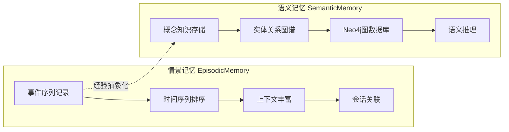

**核心差异分析：**

| 维度 | 情景记忆 | 语义记忆 |
|------|---------|---------|
| **存储内容** | 具体事件和经历 | 抽象概念和关系 |
| **核心关注** | "什么时候发生了什么" | "概念之间如何关联" |
| **时间权重** | 0.2（高）— 近期事件更有价值 | 0.05（低）— 知识不随时间贬值 |
| **图检索权重** | 0.1（低）— 事件线性记录 | 0.3（高）— 关系推理是核心能力 |
| **存储后端** | SQLite + Qdrant 混合存储 | Neo4j + Qdrant 混合存储 |

**为什么情景记忆强调时间近因性？**

从源码 `09_Memory_Types_Deep_Dive.py` 中可以看到，情景记忆记录的是完整的学习会话事件序列：

```python
# 09_Memory_Types_Deep_Dive.py — 情景记忆的事件序列记录
learning_session = [
    {"content": "开始学习Python机器学习", "context": {"stage": "学习开始"}, "importance": 0.7},
    {"content": "学习了线性回归的数学原理", "context": {"stage": "理论学习"}, "importance": 0.8},
    {"content": "实现了第一个线性回归模型", "context": {"stage": "实践编程"}, "importance": 0.9},
]
```

情景记忆模拟人类的"经历回忆"——**近期发生的事件更容易被回忆起来**，且对当前决策更有参考价值。

**为什么语义记忆强调图检索？**

语义记忆使用 Neo4j 图数据库存储知识图谱，核心能力是**关系推理**：

```python
# 09_Memory_Types_Deep_Dive.py — 语义记忆的关系存储
relationships = [
    {"content": "深度学习是机器学习的子集", "relation_type": "is_subset_of",
     "subject": "深度学习", "object": "机器学习"},
    {"content": "卷积神经网络特别适合处理图像数据", "relation_type": "suitable_for",
     "subject": "卷积神经网络", "object": "图像处理"},
]
```

图检索（权重 0.3）使得系统能够进行多跳推理，例如："CNN → 适合图像处理 → 属于深度学习 → 是机器学习的子集"。

---

### 1.2 个人健康管理助手的四种记忆组合设计

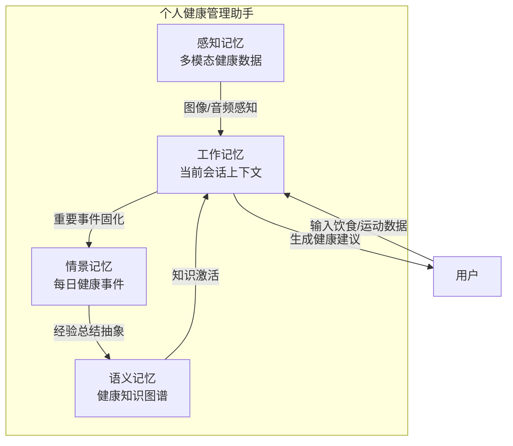

**各记忆类型的具体应用场景：**

| 记忆类型 | 应用场景 | 示例数据 | 源码参考 |
|---------|---------|---------|---------|
| **工作记忆** | 当前饮食记录的临时缓冲 | "午餐吃了300g米饭+200g鸡胸肉"，计算完成后自动清理 | `03_WorkingMemory_Implementation.py` — TTL 60分钟自动过期 |
| **情景记忆** | 每日健康事件日志 | "2024-01-15 跑步5公里，消耗400卡，心率最高160" | `09_Memory_Types_Deep_Dive.py` — 事件序列+时间线记录 |
| **语义记忆** | 健康知识图谱 | "跑步→有氧运动→降低心血管风险"、"蛋白质→肌肉修复" | `09_Memory_Types_Deep_Dive.py` — Neo4j实体关系存储 |
| **感知记忆** | 多模态健康数据 | 食物照片识别热量、运动手环心率图、睡眠脑电波数据 | `09_Memory_Types_Deep_Dive.py` — 多模态跨模态检索 |

---

### 1.3 工作记忆的 TTL 机制与整合（Consolidate）触发条件设计

> **原题：** 工作记忆采用 TTL（Time To Live）机制自动清理过期数据。请思考：在什么情况下，重要的工作记忆应该被"整合"为长期记忆？如何设计一个自动整合的触发条件？

#### 1.3.1 重新理解工作记忆：Workspace 级别的跨 Session 上下文

工作记忆不仅仅是单次 session 内的对话上下文。更准确地说，它是 **workspace 级别的短期工作上下文**——在一个项目文件夹内，用户可能跨多个 session 完成同一个任务，工作记忆在这些 session 之间以 TTL 机制持续存在。

**以 Vibe Coding 制作 PPT 为例：**

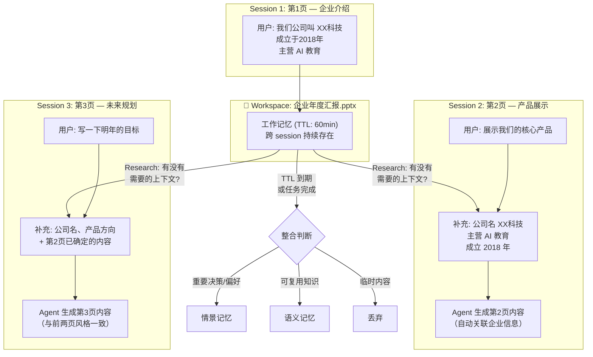

**关键洞察：TTL 的存在意义正是为了支持跨 session 的工作上下文。** 如果工作记忆只在单次 session 内有效，那第2页的 session 就无法知道第1页已经确定了企业名称和主营业务。TTL 让工作记忆在 session 之间"保鲜"——只要用户还在持续工作（session 间隔 < TTL），上下文就不会丢失。

#### 1.3.2 源码中的 TTL 与整合机制

从源码 `03_WorkingMemory_Implementation.py` 中，工作记忆的核心参数：

```python
# 03_WorkingMemory_Implementation.py — 工作记忆容量与 TTL
# 容量有限（默认50条）
# TTL机制（默认60分钟）
# 自动清理过期记忆
```

从源码 `06_Memory_Consolidation_Demo.py` 中，整合基于重要性阈值：

```python
# 06_Memory_Consolidation_Demo.py — 当前整合机制
consolidation_result = self.memory_tool.run({
    "action": "consolidate",
    "from_type": "working",
    "to_type": "episodic",
    "importance_threshold": threshold
})
```

源码中展示了多种整合路径：

```python
# 06_Memory_Consolidation_Demo.py — 多类型整合路径
("working", "episodic", 0.75, "经历记录整合"),   # 重要事件固化
("working", "semantic", 0.85, "知识提取整合"),    # 抽象知识提取
("episodic", "semantic", 0.8, "经验总结整合"),    # 经验上升为知识
```

#### 1.3.3 整合触发设计：新 Session 发起时的 Research 机制

核心思路：**每次新 session 发起对话时，Agent 应该先 research 工作记忆，判断是否有需要补充的上下文。** 这个 research 动作本身就是整合的触发点。

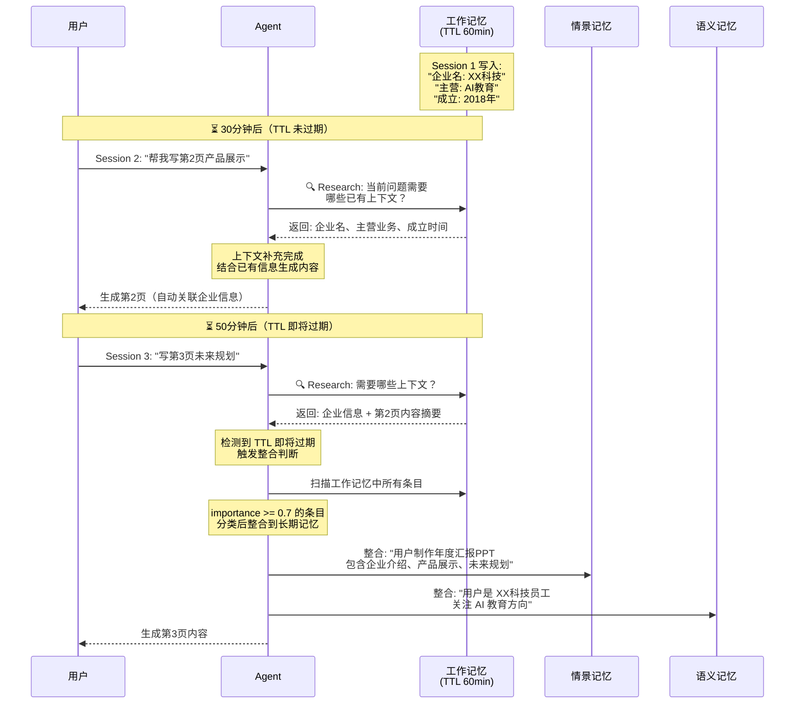

**整合触发的两个时机：**

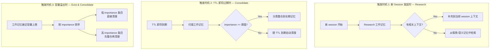

#### 1.3.4 以 PPT 制作为例的完整流程

| 时间线 | 事件 | 工作记忆状态 | 整合动作 |
|-------|------|------------|---------|
| T+0 | Session 1: 用户说"公司叫XX科技，成立2018年，做AI教育" | 写入: 企业信息 (imp=0.9) | 无 |
| T+5 | Session 1: 生成第1页企业介绍内容 | 写入: 第1页内容摘要 (imp=0.7) | 无 |
| T+30 | Session 2 开始: "帮我写第2页产品展示" | Research: 命中企业信息 | 无（TTL 充足） |
| T+35 | Session 2: Agent 结合企业信息生成第2页 | 写入: 第2页内容摘要 (imp=0.7) | 无 |
| T+55 | Session 3 开始: "写第3页未来规划" | Research: 命中企业信息+第1、2页摘要 | ⚠️ TTL 即将过期 |
| T+56 | **TTL 检查触发整合** | 扫描全部条目 | 企业信息 → 语义记忆<br/>PPT制作事件 → 情景记忆 |
| T+60 | TTL 到期 | 工作记忆清理 | 已完成整合的条目删除 |

**整合分类规则：**

```text
on(TTL 即将过期 or 容量溢出):
  for item in working_memory:

    if item.importance < 0.5:
      discard  // 临时信息，直接丢弃
      // 例: "第1页字体调成了微软雅黑" (imp=0.3)

    elif item 是 "用户偏好" or "项目事实" or "可复用知识":
      → 语义记忆
      // 例: "公司名: XX科技, 主营: AI教育" → 知识图谱节点
      // 例: "用户偏好简洁风格" → 长期偏好

    elif item 是 "任务事件" or "工作过程" or "阶段成果":
      → 情景记忆
      // 例: "2024-01-15 制作年度汇报PPT，完成3页" → 事件记录
      // 例: "第1页确定了企业介绍的叙事线" → 过程记录

    elif item 是 "临时调试" or "中间状态" or "已解决的错误":
      discard  // 不整合
      // 例: "PPT模板加载失败，重试后恢复" (imp=0.2)
```

#### 1.3.5 自动整合触发条件总结

```python
# 整合触发伪代码 — 基于 workspace 级 TTL 工作记忆

def on_new_session(user_query, workspace_id):
    """新 session 发起时的 Research 机制"""
    # 1. Research 工作记忆：当前问题需要哪些已有上下文？
    relevant_context = working_memory.search(
        query=user_query,
        workspace_id=workspace_id,
        ttl_filter="not_expired"      # 只查 TTL 未过期的
    )

    # 2. 如果工作记忆为空或不够，再查长期记忆
    if len(relevant_context) < min_context_threshold:
        long_term = episodic_memory.search(query=user_query)
        long_term += semantic_memory.search(query=user_query)
        relevant_context.extend(long_term)

    # 3. 补充上下文到当前 session
    session_context = build_context(user_query, relevant_context)

    # 4. 检查 TTL 状态，如果即将过期则触发整合
    if working_memory.ttl_remaining(workspace_id) < ttl_consolid_threshold:
        trigger_consolidation(workspace_id)


def trigger_consolidation(workspace_id):
    """TTL 驱动的记忆整合"""
    items = working_memory.get_all(workspace_id)

    for item in sorted(items, key=lambda x: x.importance, reverse=True):
        if item.importance < 0.5:
            continue  # 低重要性 → 随 TTL 自然消亡

        content_type = classify_content(item.content)

        if content_type in [USER_PREFERENCE, PROJECT_FACT, REUSABLE_KNOWLEDGE]:
            semantic_memory.add(
                content=extract_principle(item.content),
                importance=item.importance
            )
        elif content_type in [TASK_EVENT, WORK_PROGRESS, MILESTONE]:
            episodic_memory.add(
                content=item.content,
                workspace_id=workspace_id,
                timestamp=item.created_at
            )
        # else: 临时信息 → 不整合，TTL 到期自动清理
```

**TTL 在工作记忆中的真正意义：**

| 维度 | 说明 |
|------|------|
| **跨 session 上下文保鲜** | 用户在文件夹内跨多个 session 工作，TTL 确保前一个 session 的上下文在下一个 session 仍可用 |
| **自然的遗忘曲线** | 如果用户长时间不回来（> TTL），说明这个工作上下文可能已经不再需要，自然清理 |
| **整合的缓冲窗口** | TTL 到期前是整合的最佳时机——给系统一个"最后机会"把重要信息固化到长期记忆 |
| **Research 的触发点** | 每次新 session 发起时 research 工作记忆，判断是否需要补充上下文，这是整合的另一个触发点 |

---

## 2. RAG 系统中的文档处理与检索

### 2.1 无标题结构文档的分块策略优化

当前智能分块策略基于 Markdown 标题层次（`#`、`##`、`###`）进行分割（见 `04_RAGTool_MarkItDown_Pipeline.py`）：

```python
# 04_RAGTool_MarkItDown_Pipeline.py — 基于Markdown结构的分块
result = self.rag_tool.run({
    "action": "add_text",
    "text": complex_markdown,
    "chunk_size": 800,
    "chunk_overlap": 100
})
```

**对于无标题结构文档（小说、法律条文），基于"语义边界"的分块算法：**

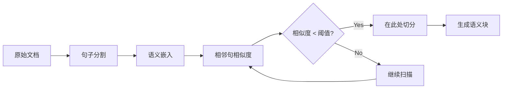

```text
语义边界分块算法（伪代码）：

on(process_document)
  sentences = split_into_sentences(raw_text)
  embeddings = embed_each(sentences)

  boundaries = []
  for i in 1..len(sentences)-1
    similarity = cosine(embeddings[i], embeddings[i+1])
    if similarity < threshold        // 语义断裂点
      boundaries.append(i)

  chunks = split_at(sentences, boundaries)
  // 重叠策略：每个块保留前后2句作为上下文桥接
  return chunks with overlap=2_sentences
```

**针对不同类型文档的补充策略：**

| 文档类型 | 语义边界信号 | 辅助策略 |
|---------|------------|---------|
| 小说 | 段落换行、对话标记（`"..."`)、场景切换 | 按章节/场景分块，保持叙事完整性 |
| 法律条文 | 条款编号（"第X条"）、款项分隔 | 按条款层级分块，保持法律逻辑完整 |
| 学术论文 | 摘要/方法/结果/讨论段落 | 按论文结构段落分块 |

---

### 2.2 基础检索、MQE 和 HyDE 三种方法对比

从源码 `05_RAGTool_Advanced_Search.py` 中可以看到三种检索策略的实现：

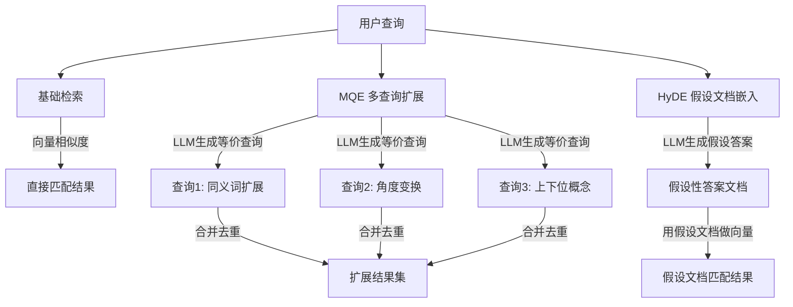

**源码中的关键对比（`05_RAGTool_Advanced_Search.py`）：**

```python
# 基础检索
basic_result = self.rag_tool.run({
    "action": "search", "query": query,
    "enable_advanced_search": False
})

# MQE检索 — 多查询扩展
mqe_result = self.rag_tool.run({
    "action": "search", "query": query,
    "enable_advanced_search": True  # 内部使用MQE
})

# HyDE检索 — 假设文档嵌入
hyde_result = self.rag_tool.run({
    "action": "ask", "question": query,
    "enable_advanced_search": True  # 内部使用HyDE生成假设答案
})
```

#### 场景一：Vibe Coding — 多 Agent 协作开发

**背景：** 用户在一个 workspace 中让 Agent 帮忙开发一个电商后台系统。工作记忆中积累了多个 session 的开发记录，现在需要为新的 Agent 构建 prompt，检索相关的开发上下文。

**用户问题：** "之前做的用户认证模块用了什么技术栈？"

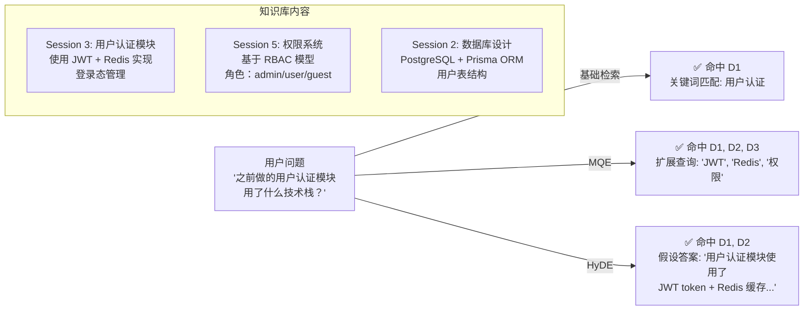

**三种方法的实际效果对比：**

| 方法 | 检索到的内容 | 耗时 | 分析 |
|------|------------|------|------|
| **基础检索** | D1 (用户认证模块, JWT + Redis) | 50ms | ✅ 精准命中关键词，但可能遗漏关联的权限系统 (D2) |
| **MQE** | D1, D2, D3 | 180ms | ✅ 扩展查询 "JWT", "Redis", "权限", "登录态" 覆盖了更多相关文档 |
| **HyDE** | D1, D2 | 250ms | ✅ 假设答案 "用户认证使用 JWT token 和 Redis 缓存" 与 D1、D2 向量距离更近 |

**Prompt 构建差异：**

```text
【基础检索构建的 Prompt】
你是一个 Agent，负责继续开发用户认证模块。
上下文：
- Session 3 中实现了用户认证，使用 JWT + Redis 管理登录态。
任务：继续完善用户认证功能。

【MQE 构建的 Prompt】
你是一个 Agent，负责继续开发用户认证模块。
上下文：
- Session 3: 用户认证模块使用 JWT + Redis 实现登录态管理
- Session 5: 权限系统基于 RBAC 模型，角色包括 admin/user/guest
- Session 2: 数据库使用 PostgreSQL + Prisma ORM，用户表已设计
任务：在现有认证和权限系统基础上，继续开发功能。

【HyDE 构建的 Prompt】
你是一个 Agent，负责继续开发用户认证模块。
上下文：
- 用户认证模块使用了 JWT token 和 Redis 缓存来管理登录态
- 权限系统基于 RBAC 模型，支持多角色访问控制
任务：基于现有的 JWT + Redis 认证方案和 RBAC 权限系统，继续开发。
```

**结论：** 在 vibe coding 场景中，**MQE 效果最好**——因为开发记录分散在多个 session 中，需要多角度扩展查询才能召回完整上下文。HyDE 次之，基础检索可能遗漏关键关联信息。

---

#### 场景二：Research Workspace — 多 Agent Prompt 构建

**背景：** 一个 research workspace 中积累了大量论文阅读笔记、实验记录、会议纪要。现在需要为不同的 Agent 构建 prompt，让它们协作完成一个研究任务。

**用户问题：** "Transformer 在 NLP 任务中的优势是什么？"

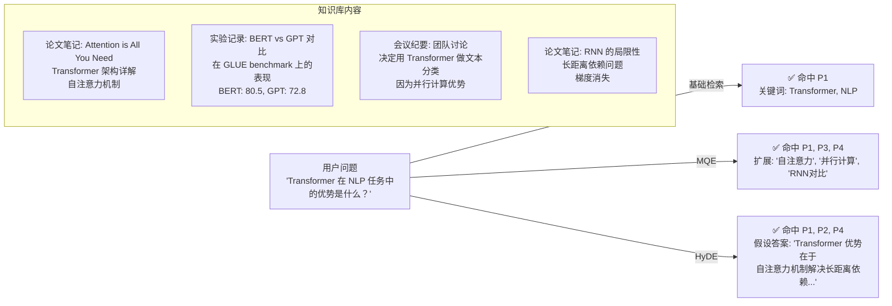

**三种方法的实际效果对比：**

| 方法 | 检索到的内容 | 耗时 | 分析 |
|------|------------|------|------|
| **基础检索** | P1 (Attention is All You Need) | 45ms | ⚠️ 只命中直接关键词，遗漏了对比实验 (P2) 和决策依据 (P3) |
| **MQE** | P1, P3, P4 | 200ms | ✅ 扩展查询 "自注意力", "并行计算", "RNN 对比" 覆盖了技术优势和对比依据 |
| **HyDE** | P1, P2, P4 | 280ms | ✅ 假设答案 "Transformer 优势在于自注意力机制解决长距离依赖" 命中了技术原理和对比实验 |

**Prompt 构建差异：**

```text
【基础检索构建的 Prompt】
你是一个研究 Agent，负责总结 Transformer 在 NLP 中的优势。
上下文：
- Transformer 架构基于自注意力机制（来自 Attention is All You Need 论文）
任务：总结 Transformer 的优势。

【MQE 构建的 Prompt】
你是一个研究 Agent，负责总结 Transformer 在 NLP 中的优势。
上下文：
- Transformer 架构基于自注意力机制，支持并行计算
- 团队决定用 Transformer 做文本分类，因为并行计算优势
- RNN 存在长距离依赖问题和梯度消失问题
任务：对比 RNN，总结 Transformer 的优势，并说明团队选择 Transformer 的原因。

【HyDE 构建的 Prompt】
你是一个研究 Agent，负责总结 Transformer 在 NLP 中的优势。
上下文：
- Transformer 通过自注意力机制解决了 RNN 的长距离依赖问题
- 在 GLUE benchmark 上，BERT (基于 Transformer) 达到 80.5 分，优于 GPT 的 72.8 分
- Transformer 支持并行计算，训练效率更高
任务：基于实验数据和架构对比，总结 Transformer 的技术优势。
```

**结论：** 在 research workspace 场景中，**HyDE 效果最好**——因为研究问题通常是定义性、对比性的，假设答案能更好地匹配论文笔记和实验记录中的技术描述。MQE 次之，基础检索可能遗漏关键的对比依据。

---

#### 三种方法总结对比

| 维度 | 基础检索 | MQE (多查询扩展) | HyDE (假设文档嵌入) |
|------|---------|-----------------|-------------------|
| **原理** | 查询→向量→相似度匹配 | LLM 生成多个等价查询，合并结果 | LLM 生成假设答案，用答案做检索 |
| **速度** | ⭐⭐⭐⭐⭐ 最快 (~50ms) | ⭐⭐⭐ 中等 (~200ms) | ⭐⭐ 较慢 (~280ms) |
| **召回率** | ⭐⭐ 受限于查询表述 | ⭐⭐⭐⭐⭐ 多角度扩展，覆盖面广 | ⭐⭐⭐⭐ 假设答案匹配文档形态 |
| **适用场景** | 关键词明确的精确查询 | 信息分散、需要多角度召回 | 定义性、对比性、解释性问题 |
| **Vibe Coding** | ⚠️ 可能遗漏关联上下文 | ✅ **最佳** — 开发记录分散，需要多角度召回 | ✅ 良好 |
| **Research Workspace** | ⚠️ 可能遗漏对比依据 | ✅ 良好 | ✅ **最佳** — 研究问题多为定义/对比类 |
| **成本** | ⭐⭐⭐⭐⭐ 零额外成本 | ⭐⭐⭐ 需要 LLM 生成查询 | ⭐⭐ 需要 LLM 生成假设答案 |

**选型建议：**

```text
if 查询关键词明确 and 信息集中:
    使用 基础检索 — 速度最快，成本最低

elif 信息分散在多个文档 and 需要完整上下文:
    使用 MQE — 多角度扩展，召回率最高
    # 典型场景: Vibe Coding 中检索开发历史

elif 问题是定义性/对比性 and 文档是陈述性描述:
    使用 HyDE — 假设答案与文档形态匹配
    # 典型场景: Research Workspace 中检索论文笔记

elif 需要最高质量 and 不关心成本:
    使用 MQE + HyDE 组合 — 双重扩展，最大化检索效果
```

---

### 2.3 三种嵌入方案对比评估

从源码中可以看到系统支持多种嵌入方案。`02_MemoryTool_Architecture.py` 展示了存储架构：

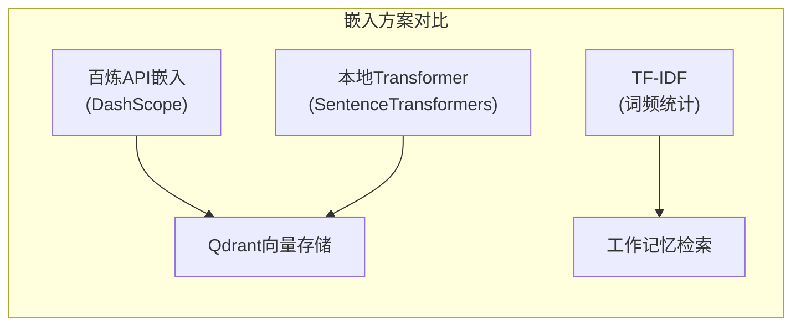

**多维度评估：**

| 维度 | 百炼API (DashScope) | 本地Transformer | TF-IDF |
|------|-------------------|----------------|--------|
| **准确性** | ⭐⭐⭐⭐⭐ 高维语义表示 | ⭐⭐⭐⭐ 良好的语义理解 | ⭐⭐ 纯词频匹配 |
| **速度** | ⭐⭐ 受网络延迟影响 (~200ms/次) | ⭐⭐⭐ 本地推理 (~50ms/次) | ⭐⭐⭐⭐⭐ 极快 (~1ms/次) |
| **成本** | ⭐⭐ 按token计费 | ⭐⭐⭐⭐ 一次性GPU投入 | ⭐⭐⭐⭐⭐ 零成本 |
| **离线部署** | ❌ 需要网络 | ✅ 完全离线 | ✅ 完全离线 |
| **中文支持** | ⭐⭐⭐⭐⭐ 原生优化 | ⭐⭐⭐⭐ 需选择中文模型 | ⭐⭐⭐ 需分词处理 |

**选型建议：**

```text
if 生产环境 and 有网络:
    选择 百炼API — 最佳质量，弹性扩展
elif 隐私要求高 or 离线需求:
    选择 本地Transformer — 数据不出域
elif 资源受限 or 快速原型:
    选择 TF-IDF — 零成本启动（工作记忆默认方案）
```

---

## 3. 记忆系统的"遗忘"机制

### 3.1 智能遗忘策略设计

从源码 `01_MemoryTool_Basic_Operations.py` 中，当前提供三种遗忘策略：

```python
# 01_MemoryTool_Basic_Operations.py — 当前遗忘策略
result = memory_tool.run({
    "action": "forget",
    "strategy": "importance_based",  # 仅基于重要性
    "threshold": 0.2
})
```

**智能遗忘策略——多因素加权评分：**

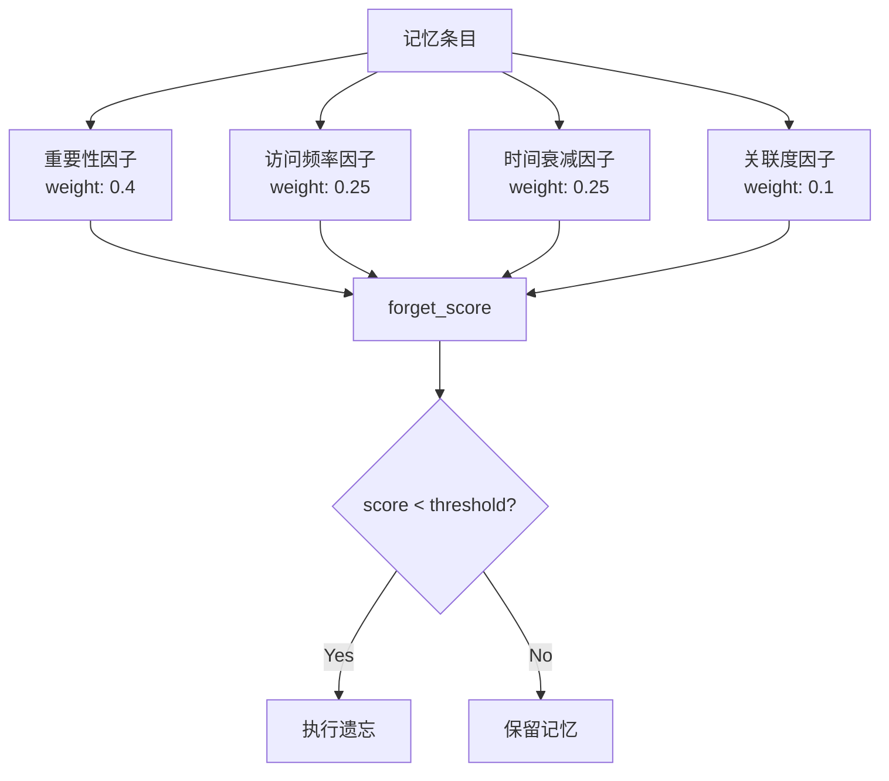

```text
智能遗忘评分公式：

forget_score = 0.4 × importance
             + 0.25 × (1 / (1 + log(1 + access_count)))   // 访问越少越易遗忘
             + 0.25 × time_decay(last_access_time)          // 越久未访问越易遗忘
             + 0.10 × (1 - related_memory_ratio)            // 关联越少越易遗忘

time_decay(t) = 1 - e^(-λ × days_since_access)
```

```python
# 智能遗忘策略伪代码实现
def smart_forget(memory_items, threshold=0.3):
    for item in memory_items:
        score = (
            0.40 * item.importance
            + 0.25 * (1 / (1 + log(1 + item.access_count)))
            + 0.25 * (1 - exp(-0.1 * item.days_since_access))
            + 0.10 * (1 - item.related_memory_ratio)
        )
        if score < threshold:
            forget(item)
```

---

### 3.2 记忆归档机制设计

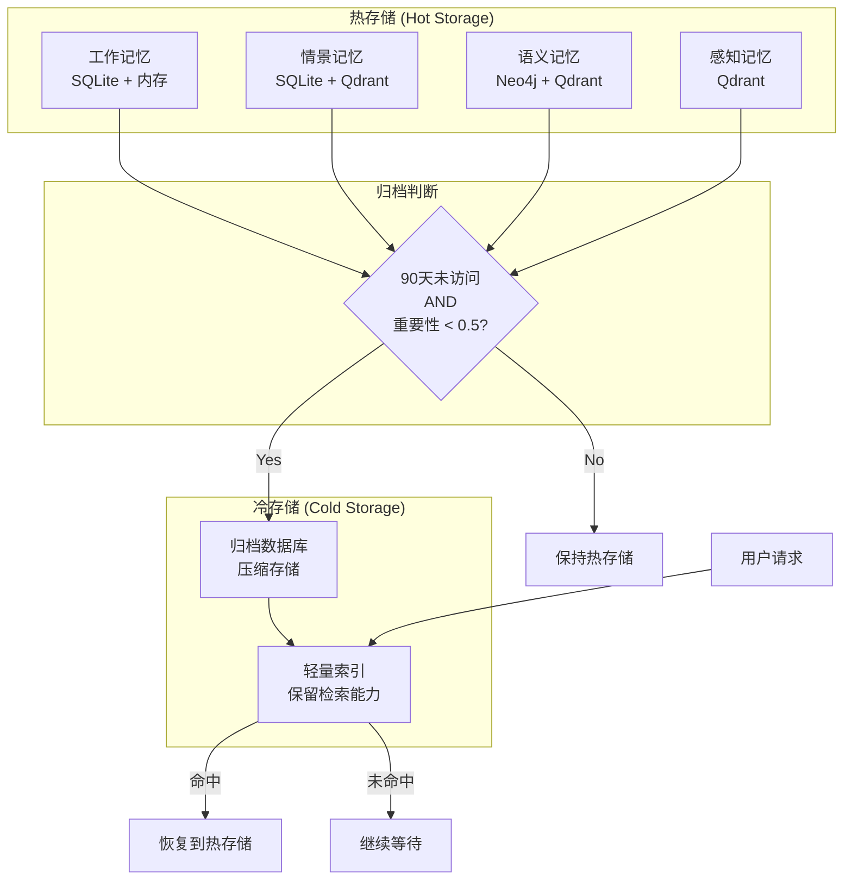

**与四种记忆类型的集成方案：**

| 记忆类型 | 归档条件 | 归档策略 | 恢复策略 |
|---------|---------|---------|---------|
| 工作记忆 | TTL过期 | 不归档，直接清理 | 不可恢复（设计如此） |
| 情景记忆 | 90天未访问 + 重要性<0.5 | 压缩归档到冷存储，保留时间线索引 | 按时间范围查询时恢复 |
| 语义记忆 | 180天未访问 + 图连接度<2 | 导出为JSON归档，保留实体名索引 | 相关查询触发恢复 |
| 感知记忆 | 120天未访问 + 重要性<0.4 | 原始数据归档，保留摘要向量 | 按内容检索时恢复 |

---

### 3.3 敏感信息的彻底清除

在使用向量数据库（Qdrant）和图数据库（Neo4j）的情况下，**仅仅从数据库删除是不够的**：

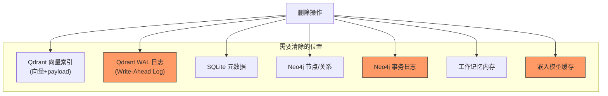

**彻底清除方案：**

```text
1. 向量数据库 (Qdrant):
   - 按 point_id 删除向量及 payload
   - 触发 Qdrant 的 vacuum 操作清理 WAL
   - 验证：重新搜索确认无残留

2. 图数据库 (Neo4j):
   - MATCH (n {user_id: "xxx"}) DETACH DELETE n
   - 清除所有相关关系和属性
   - 检查事务日志是否需要轮转

3. 嵌入模型缓存:
   - 清除本地 SentenceTransformer 缓存中的相关向量
   - 清除 TF-IDF 矩阵中的相关行

4. 审计验证:
   - 执行全库扫描确认无残留
   - 检查备份系统中是否存在副本
```

---

## 4. 智能学习助手案例分析

### 4.1 RAG vs Memory 的智能路由设计

从源码 `11_Q&A_Assistant.py` 中可以看到 `ask_question()` 同时使用 RAG 和 Memory：

```python
# 11_Q&A_Assistant.py — ask()方法同时使用RAG和Memory
def ask(self, question: str, use_advanced_search: bool = True) -> str:
    # 1. 记录问题到工作记忆
    self.memory_tool.run({
        "action": "add", "content": f"提问: {question}",
        "memory_type": "working", "importance": 0.6
    })
    # 2. 使用RAG检索答案
    answer = self.rag_tool.run({
        "action": "ask", "question": question,
        "enable_advanced_search": use_advanced_search
    })
    # 3. 记录到情景记忆
    self.memory_tool.run({
        "action": "add", "content": f"关于'{question}'的学习",
        "memory_type": "episodic", "importance": 0.7
    })
```

**智能路由机制设计：**

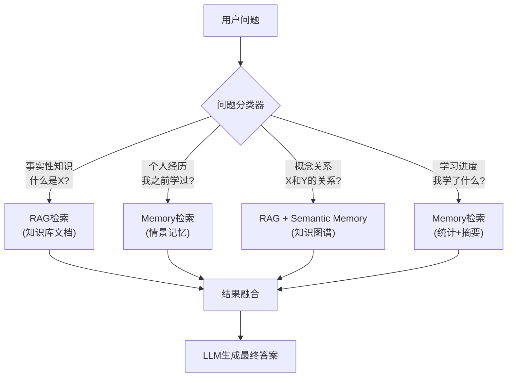

**路由判断规则：**

| 查询特征 | 优先使用 | 判断依据 |
|---------|---------|---------|
| "什么是..."、"如何..." | RAG | 需要外部知识文档 |
| "我之前..."、"上次..." | Memory | 需要个人历史记录 |
| "X和Y的关系" | Semantic Memory | 需要知识图谱推理 |
| "推荐下一步学什么" | Memory + RAG | 需要学习历史 + 知识结构 |

---

### 4.2 智能学习报告生成器设计

当前 `generate_report()` 只包含统计信息（见 `11_Q&A_Assistant.py`）：

```python
# 11_Q&A_Assistant.py — 当前报告只有基础统计
report = {
    "session_info": {...},
    "learning_metrics": {
        "documents_loaded": self.stats["documents_loaded"],
        "questions_asked": self.stats["questions_asked"],
        "concepts_learned": self.stats["concepts_learned"]
    },
    "memory_summary": memory_summary,
    "rag_status": rag_stats
}
```

**扩展的智能学习报告生成器：**

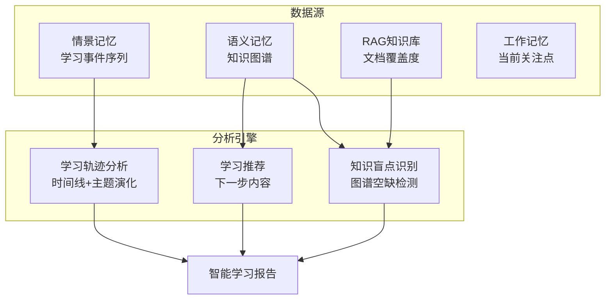

**所需记忆类型和检索策略：**

| 功能 | 使用的记忆类型 | 检索策略 |
|------|-------------|---------|
| 学习轨迹分析 | 情景记忆 | 按时间线检索，构建事件序列 |
| 知识盲点识别 | 语义记忆（知识图谱） | 图遍历检测孤立节点和缺失边 |
| 学习推荐 | 语义记忆 + RAG | 图谱邻居发现 + 文档相关性 |
| 掌握度评估 | 情景记忆 + 工作记忆 | 问答正确率统计 + 重复查询分析 |

---

### 4.3 多用户 Web 服务的数据隔离方案

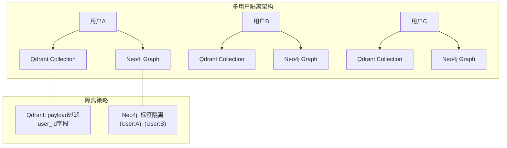

**Qdrant 数据隔离：**

```python
# 方案1: 命名空间隔离（推荐，源码已使用此方案）
# 11_Q&A_Assistant.py 中已有:
self.rag_tool = RAGTool(rag_namespace=f"pdf_{user_id}")

# 方案2: Payload过滤
# 在每条向量中添加 user_id payload，查询时过滤
self.memory_tool = MemoryTool(user_id=user_id)  # 源码已实现
```

**Neo4j 数据隔离：**

```text
方案1: 标签隔离
  - 每个用户的节点添加标签 :User_A, :User_B
  - 查询: MATCH (n:User_A) WHERE ...

方案2: 属性过滤（更灵活）
  - 每个节点添加 user_id 属性
  - 查询: MATCH (n) WHERE n.user_id = 'user_A'

方案3: 数据库隔离（最强隔离）
  - 每个用户独立的 Neo4j 数据库实例
  - 适合企业级多租户场景
```

**性能优化建议：**

| 优化方向 | 策略 | 效果 |
|---------|------|------|
| 检索缓存 | 按 (user_id, query_hash) 缓存结果 | 减少重复计算 |
| 连接池 | Qdrant/Neo4j 连接池复用 | 减少连接开销 |
| 批量查询 | 多用户查询批量处理 | 提高吞吐量 |
| 索引优化 | user_id 字段建索引 | 加速过滤查询 |

---

## 5. 语义记忆与知识图谱

### 5.1 自动实体/关系提取的准确性分析

从源码 `09_Memory_Types_Deep_Dive.py` 中，语义记忆自动提取实体和关系：

```python
# 09_Memory_Types_Deep_Dive.py — 自动实体关系提取
entities_and_relations = [
    {"content": "TensorFlow是Google开发的深度学习框架",
     "entity_type": "framework", "developer": "Google"},
    {"content": "PyTorch是Facebook开发的深度学习框架",
     "entity_type": "framework", "developer": "Facebook"},
    {"content": "BERT是基于Transformer的预训练语言模型",
     "entity_type": "model", "architecture": "Transformer"},
]
```

**可能出现错误的情况：**

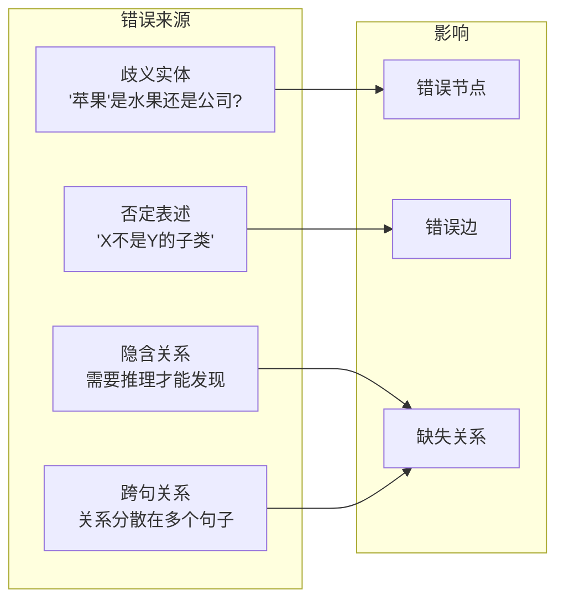

**知识图谱质量评估机制设计：**

```text
质量评估维度：

1. 实体准确性 (Entity Precision)
   - 实体是否存在歧义？
   - 实体类型标注是否正确？
   - 评估方法：人工抽样验证 + 置信度评分

2. 关系准确性 (Relation Precision)
   - 关系类型是否正确？
   - 关系方向是否正确？（A→B vs B→A）
   - 评估方法：图一致性检查 + 对称关系验证

3. 完整性 (Completeness)
   - 是否遗漏了重要关系？
   - 是否存在孤立节点？
   - 评估方法：与外部知识图谱对比

4. 一致性 (Consistency)
   - 是否存在矛盾关系？
   - 是否存在循环依赖？
   - 评估方法：图约束检查（如传递性验证）

kg_quality = 0.3 × entity_precision
           + 0.3 × relation_precision
           + 0.2 × completeness
           + 0.2 × consistency
```

---

### 5.2 知识图谱的多跳查询场景

**设计场景：技术学习路径推理**

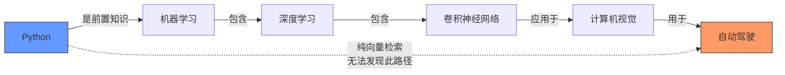

**Neo4j Cypher 查询示例：**

```cypher
// 多跳关系查询：从Python到自动驾驶的完整学习路径
MATCH path = (start:Concept {name: "Python"})-[:PREREQUISITE*1..5]->(end:Concept {name: "自动驾驶"})
RETURN path

// 路径查找：找到两个概念之间的最短路径
MATCH path = shortestPath(
  (a:Concept {name: "线性代数"})-[*]-(b:Concept {name: "Transformer"})
)
RETURN path

// 共同前置知识：学习CNN和NLP共同需要什么？
MATCH (common)-[:PREREQUISITE]->(:Concept {name: "CNN"})
MATCH (common)-[:PREREQUISITE]->(:Concept {name: "NLP"})
RETURN common.name AS 共同前置知识
```

---

### 5.3 向量检索 vs 图检索：混合策略对比

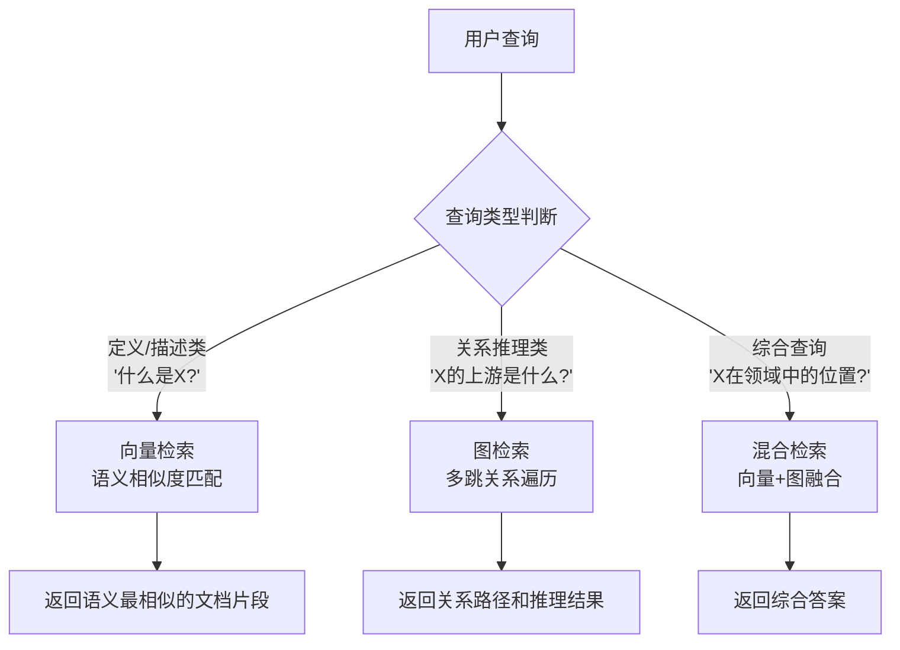

**具体例子对比：**

| 查询类型 | 示例 | 向量检索效果 | 图检索效果 | 推荐 |
|---------|------|------------|-----------|------|
| **定义查询** | "什么是Transformer？" | ✅ 精准匹配定义段落 | ❌ 只能返回节点属性 | 向量检索 |
| **关系查询** | "CNN属于哪个更大的类别？" | ❌ 无法回答层级关系 | ✅ 沿 is_subset_of 边遍历 | 图检索 |
| **路径查询** | "学习线性代数对Transformer有什么用？" | ❌ 无法发现间接关联 | ✅ 多跳路径发现 | 图检索 |
| **相似查询** | "和BERT类似的技术有哪些？" | ✅ 语义空间近邻搜索 | ⚠️ 只能找直接关联 | 向量检索 |
| **综合查询** | "Transformer在NLP领域的地位和影响" | ✅ 找到相关描述 | ✅ 找到影响关系链 | 混合检索 |

**混合检索的融合策略：**

```text
final_score = α × vector_similarity_score
            + β × graph_relevance_score
            + γ × freshness_score

其中：
- α = 0.5 (向量检索权重)
- β = 0.3 (图检索权重)
- γ = 0.2 (时间新鲜度权重)
```

---

## 附录：源码文件索引

| 文件 | 内容 | 对应题目 |
|------|------|---------|
| `01_MemoryTool_Basic_Operations.py` | MemoryTool 基础操作 | 1.1, 3.1 |
| `02_MemoryTool_Architecture.py` | 架构设计与分层 | 2.3 |
| `03_WorkingMemory_Implementation.py` | 工作记忆实现 | 1.2, 1.3 |
| `04_RAGTool_MarkItDown_Pipeline.py` | MarkItDown 处理管道 | 2.1 |
| `05_RAGTool_Advanced_Search.py` | MQE/HyDE 高级检索 | 2.2 |
| `06_Memory_Consolidation_Demo.py` | 记忆整合机制 | 1.3 |
| `07_RAGTool_Intelligent_QA.py` | 智能问答系统 | 4.1 |
| `08_Agent_Tool_Integration.py` | Agent 工具集成 | 4.1, 4.2 |
| `09_Memory_Types_Deep_Dive.py` | 四种记忆类型深度解析 | 1.1, 1.2, 5.1 |
| `10_RAG_Pipeline_Complete.py` | RAG 完整管道 | 2.1, 2.2 |
| `11_Q&A_Assistant.py` | 智能文档问答助手 | 4.1, 4.2, 4.3 |
